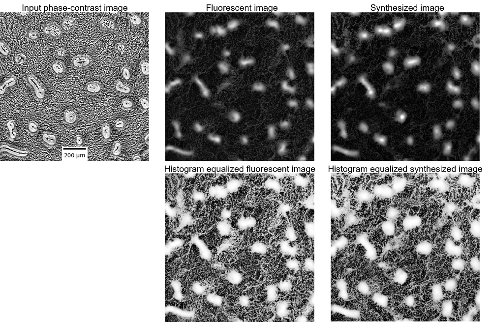
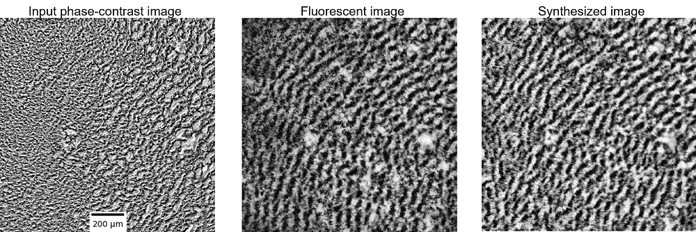

Quantification of *Myxococcus xanthus* Aggregation and Rippling Behaviors: Deep-learning Trasformation of Phase-contrast into Fluorescence Microscopy Images

# pix2pixHD-HE
### [Project](https://github.com/IgoshinLab/pix2pixHD-HE/) | [Paper]() <br>
Pytorch implementation of our method for high-resolution (e.g. 1008x1008) image transformation of phase-contrast into fluorescence microscopy images. <br><br>
[Quantification of *Myxococcus xanthus* Aggregation and Rippling Behaviors: Deep-learning Trasformation of Phase-contrast into Fluorescence Microscopy Images](https://github.com/IgoshinLab/pix2pixHD-HE/)  
 [Jiangguo Zhang](https://JiangguoZhang.github.io/)<sup>1</sup>, [Jessica A. Comstock](https://thecollege.syr.edu/people/graduate-students/comstock-jessica/)<sup>2</sup>, [Christopher R. Cotter](https://shimkets.uga.edu/who/cotter)<sup>1</sup>, [Patrick A. Murphy](https://igoshin.rice.edu/people.html)<sup>1</sup>, [Weili Nie](https://weilinie.github.io/)<sup>3</sup>, [Ankit B. Patel](https://ankitlab.co/)<sup>3,4</sup>, [Roy D. Welch](http://www.welchlab.net/)<sup>2</sup>, [Oleg A. Igoshin](https://igoshin.rice.edu/index.html)<sup>1</sup> 

 <sup>1</sup>Department of Bioengineering, Rice University, Houston, TX 77005, USA,
 
 <sup>2</sup>Department of Biology, Syracuse University, Syracuse, NY 13244, USA,
 
 <sup>3</sup>Department of Electrical and Computer Engineering, Rice University, Houston, TX 77005, USA,
 
 <sup>4</sup>Department of Neuroscience, Baylor College of Medicine, Houston, TX 77005, USA

## Transform phase-contrast to fluorescent images of *Myxococcus xanthus*
- Aggregates and streams
<p align='left'>
  
</p>

- Ripples
<p align='left'>
  
</p>

## Prerequisites
- Anaconda 3 for python 3.7
- NVIDIA GPU (11G memory or larger) + CUDA cuDNN

## Getting Started
### Installation
- Get Anaconda 3 from https://www.anaconda.com/products/individual
- Install Anaconda 3
- Clone this repo: (Make sure you have at least 1GB memory space)
```bash
git clone https://github.com/IgoshinLab/pix2pixHD-HE
cd pix2pixHD-HE
```
- Import and activate the environment
```bash
conda env create -f environment.yaml
conda activate pix2pixHD-HE
```
## Testing
  A sub set of the test set mentioned in our paper is provided in /data/.

```bash
python test_pix2pixHD_HE.py --name-list hr7
```

## Training on rippling images
 A sub set of the test rippling dataset mentioned in our paper is provided in /data/.
```bash
python train_pix2pixHD_HE.py --name-list r0
```

# Acknowledgments
The idea of this code borrows heavily from [pix2pixHD](https://github.com/NVIDIA/pix2pixHD/).


