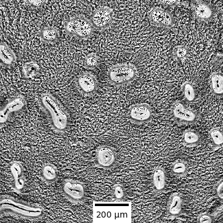
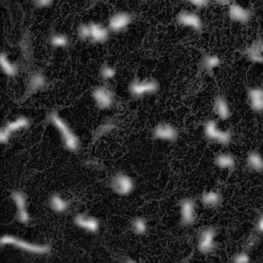
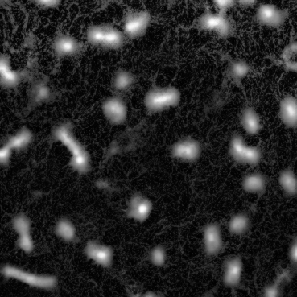
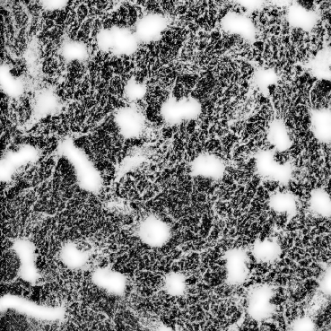
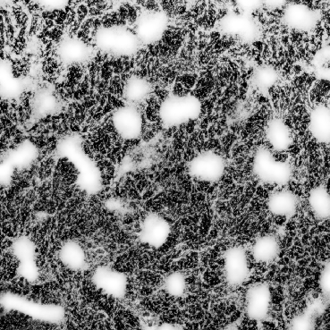

Quantification of *Myxococcus xanthus* Aggregation and Rippling Behaviors: Deep-learning Trasformation of Phase-contrast into Fluorescence Microscopy Images

# pix2pixHD-HE
### [Project](https://github.com/IgoshinLab/pix2pixHD-HE/) | [Paper]()  
Pytorch implementation of our method for high-resolution (e.g. 1008x1008) image transformation of phase-contrast into fluorescence microscopy images.   
[Quantification of *Myxococcus xanthus* Aggregation and Rippling Behaviors: Deep-learning Trasformation of Phase-contrast into Fluorescence Microscopy Images](https://github.com/IgoshinLab/pix2pixHD-HE/)  
 [Jiangguo Zhang](https://JiangguoZhang.github.io/)1, [Jessica A. Comstock]()1
 1Department of Bioengineering, Rice University, Houston, TX 77005, USA, 2Department of Biology, Syracuse University, Syracuse, NY 13244, USA  

## Transform phase-contrast to fluorescent images of *Myxococcus xanthus*
- Aggregates and streams

  
  
  

  
  

- Ripples
